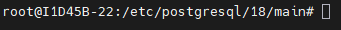

# SGBD (Sistema Gerenciador de Banco de Dados)
Instalar e configurar o SGBD Postgresql

**Porta padrão de Banco de dados**:
>5432

Comando para instalar o SGBD:

```bash
sudo apt install -y postgresql
```
>Obs: O comando sudo, no nosso caso, pode ser omitido pois já somos root.
---
Comando para realizar a verificação do SGBD:
```bash
pg_lsclusters
```

Comando para entrar no SGBD **sem senha**, Utilizar o comando:
```bash
sudo -u postgres psql
```
> Com esse comando o acesso é feito sem senha, pois o Linux já provou quem você é (root). Autenticação PEER.

Para primeiro acesso, alterei a senha:

```sql
ALTER USER postgres PASSWORD '1524';
```

> O retorno correto, é `ALTER ROLE`.

**Sempre usar letra maiúsculas no SGBD**

Para sair do postgres, comando `\q` (igual o \quit de vários jogos).


---
## Configurações de serviço
> Caminho padrão para as configurações do POSTGRESQL



**Primeira configuração**:
```bash
sudo nano postgresql.conf
```
CTRL + F ou CTRL + W para buscar a linha do listen_addresses e descomentamos, alterando para '*'.
> listen_addresses '*'

Se ficar localhost, somente o meu PC acessa.

**Segunda configuração:**
```bash
sudo nano pg_hba.conf
```
Nas ultimas linhas, adicionei:
host all all 10.87.38.0/24 scram-sha-256

**O 24 no fim do IP significa que libera todos os IP da rede 10.87.38**

>Obs: se eu colocasse 0.0.0.0/24 liberaria para todos os IP do mundo poder acessar meu servidor

Para criar um banco de dados, usamos o comando:
```sql
CREATE DATABASE lojamax;
```
Para visualizar os bancos:
```bash
/l
```