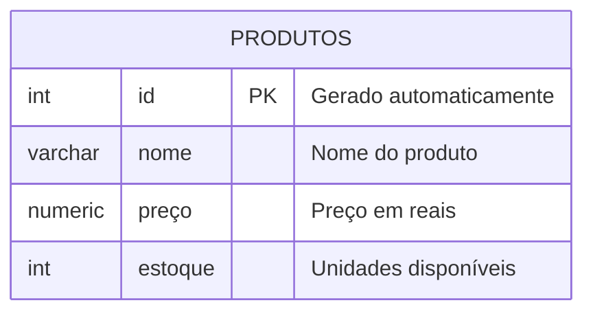

## AULA 04 
Comando para apagar um banco de dados

```sql
DROP DATABASE lojamax;
```
Comando para criar um banco de dados
```sql
CREATE DATABASE loja;
```
---
O Objetivo é criar uma loja para aprender os principais comandos SQL.

Primary Key (PK)



Para criar a tabela, utilizamos os comandos abaixo:
```sql
CREATE TABLE produtos(
    id INT GENERATED ALWAYS AS IDENTITY PRIMARY KEY,
    nome VARCHAR(50) NOT NULL,
    preco NUMERIC(10,2) NOT NULL,
    estoque INT NOT NULL DEFAULT 0
);
```

Para inserir dados na tabela, utilizei os comandos abaixo:
```sql
INSERT INTO produtos(nome,preco,estoque)
VALUES('Iphone 17','10000.00','15');
```