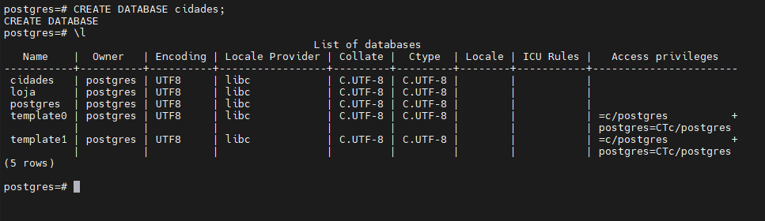
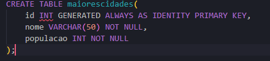
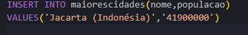
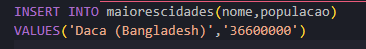
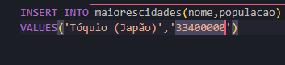
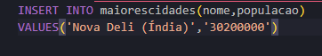
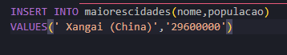
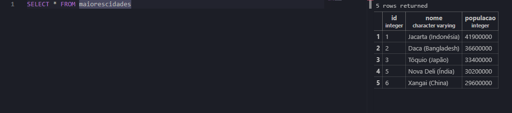

# Atividade AULA 04 - Criação e edição do primeiro banco de dados

## **Primeiro passo - Criar o Banco de Dados:** 

## **Segundo passo - Criar uma tabela das maiores cidades "maiorescidades" e adicionar como, colunas: id, nome, populacao:**

## **Terceiro passo - Inserir registros das 5 maiores cidades do mundo:**
1° Cidade:

2° Cidade:

3° Cidade:

4° Cidade:

5° Cidade:

## **Quarto e último passo - Consultar os 5 registros

