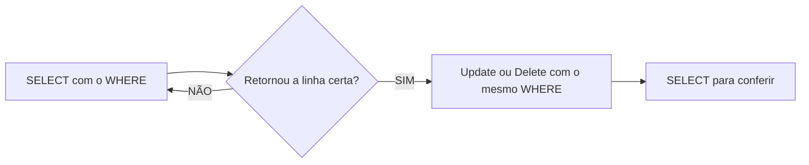

## Aula 05
Para filtrar colunas, utilizamos o comando:
```sql
SELECT nome,populacao FROM maiorescidades;
```

Para filtros de registros, utilizamos o comando:

```sql
SELECT * FROM maiorescidades WHERE populacao < 35000000
```

Para ordenar os dados:

```sql
SELECT nome,populacao FROM maiorescidades
ORDER BY populacao DESC;
```

---

**UPDATE**: Update ou Delete sem `WHERE` atinge TODAS as linhas! Não existe CTRL + Z :(

Fluxo seguro (sempre):


Para UPDATE:
```sql
UPDATE maiorescidades
SET populacao=30000000
WHERE nome='Xangai (China)';
```

---
Também é possível realizar cálculos:
```sql
UPDATE maiorescidades
SET populacao = populacao - 1000000
WHERE id = 2;
```

**DELETE**

Para apagar registros:
```sql
DELETE FROM maiorescidades WHERE nome='Xangai (China)';
```