# Análise de Dados (Livraria)

### Crie uma tabela com as colunas (id,nome,autor,preco,genero,estoque,ano_publicacao)

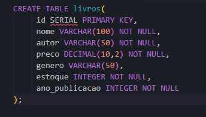
---

### Adicionando as informações na tabela

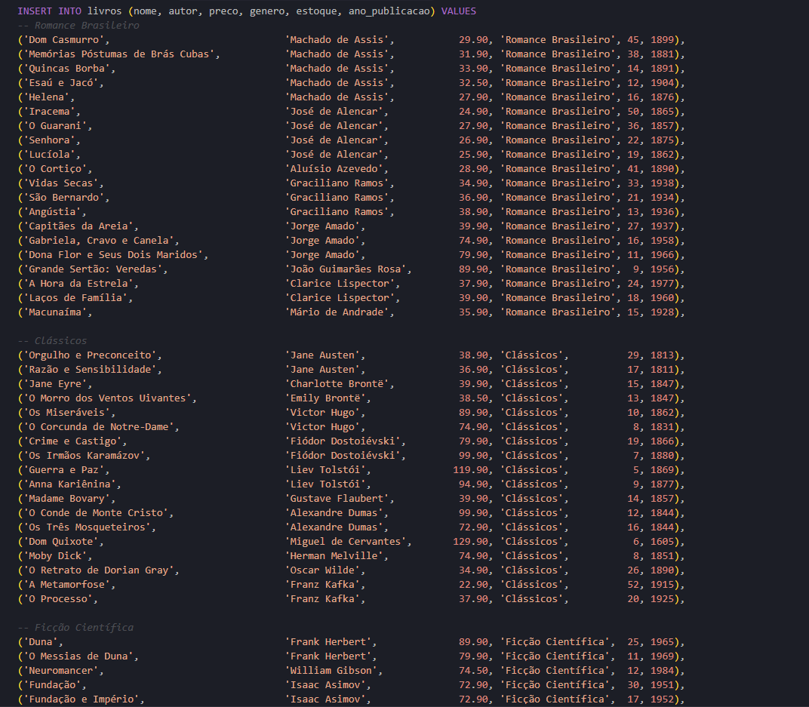
---

### 1. Exiba todos os dados da tabela, mas limitando o resultado aos 10 primeiros registros.

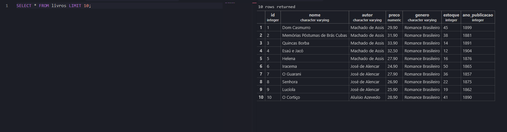

---

### 2. Exiba apenas as colunas titulo, autor e preco de todos os livros.

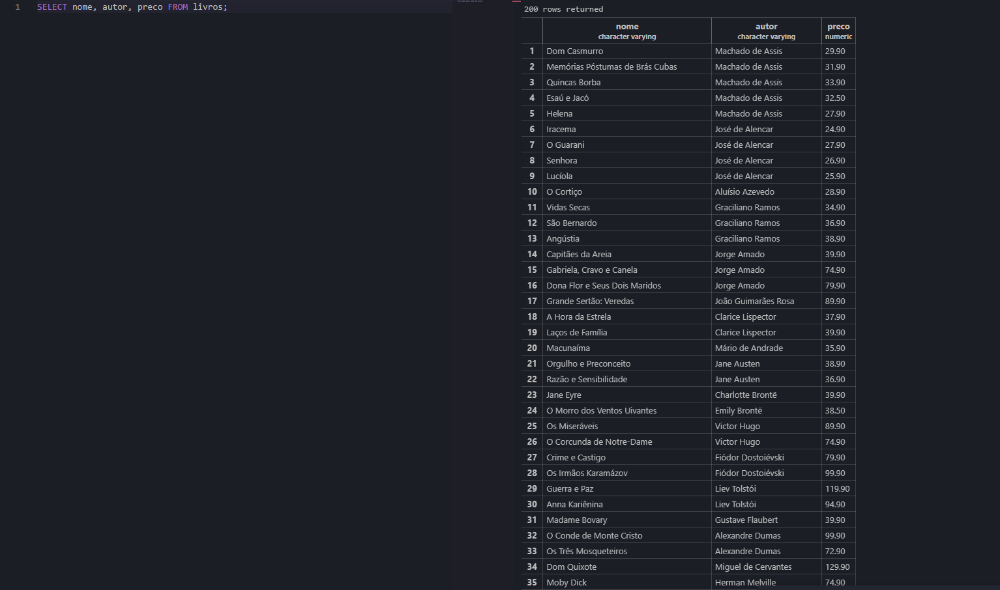

---

### 3. Liste os gêneros distintos existentes na base, em ordem alfabética.

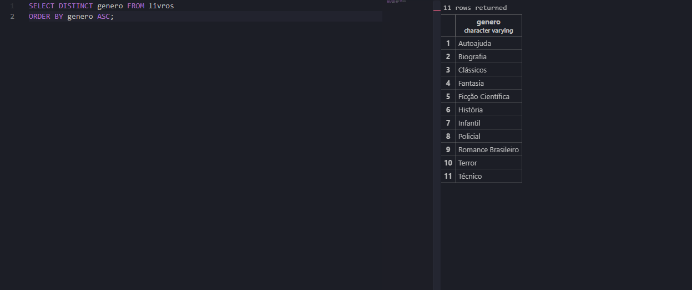

---

### 4. Descubra quantos autores diferentes existem.

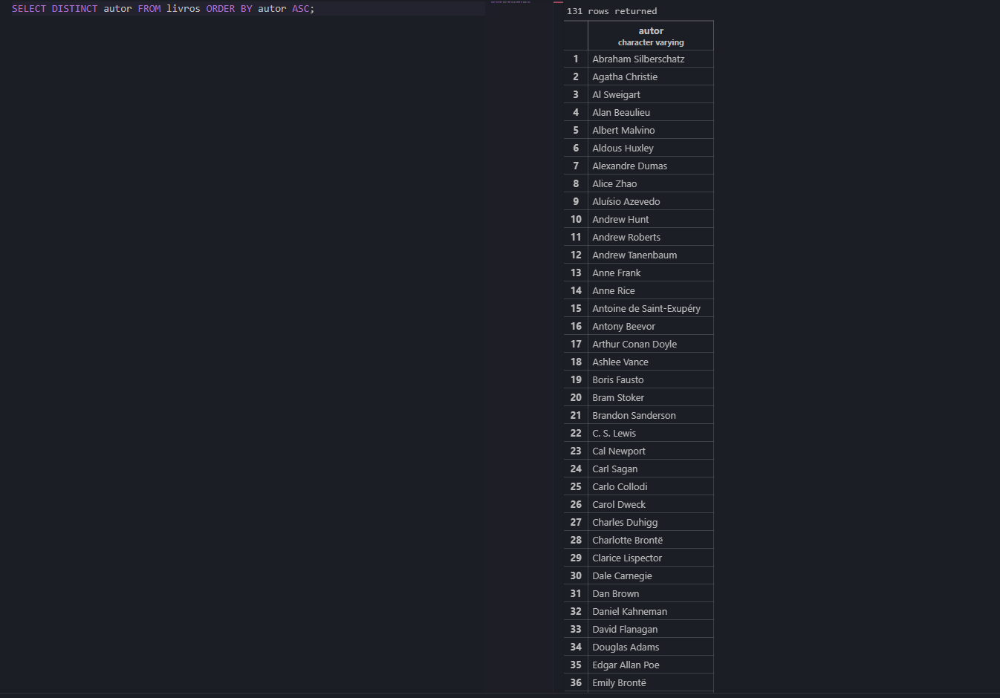

---

### 5. Liste os 5 livros mais caros da base (título e preço).

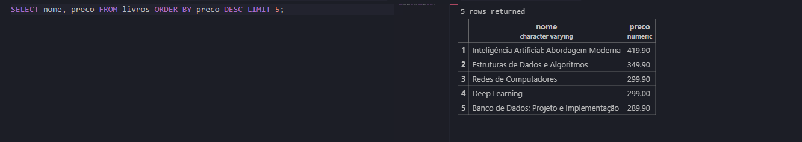

---

### 6. Liste os 5 livros com menor estoque (título e estoque).

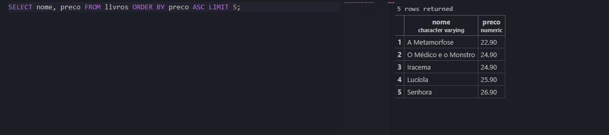

---

### 7. Mostre titulo e estoque de todos os livros do gênero Técnico.

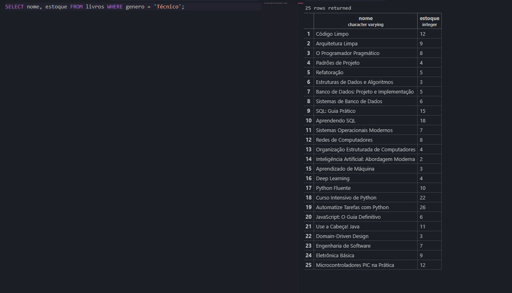

---

### 8. Mostre titulo e preco dos livros que custam mais de R$ 200,00.

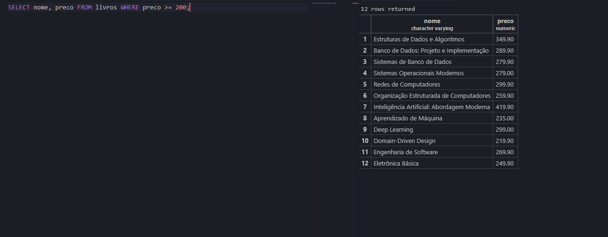

---

### 9. Mostre titulo e preco dos livros com preço entre R$ 40,00 e R$ 70,00.

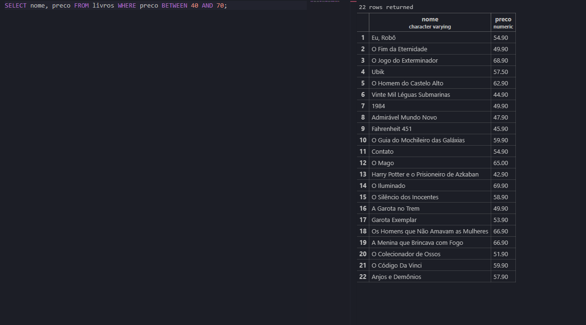

---

### 10. Mostre os livros com estoque abaixo de 5 unidades (situação de reposição urgente).

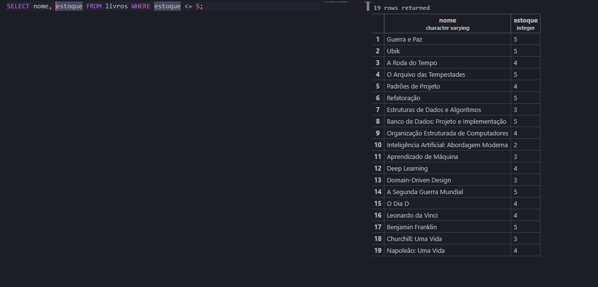

---

### 11. Liste os livros publicados antes de 1900, ordenados do mais antigo para o mais recente.

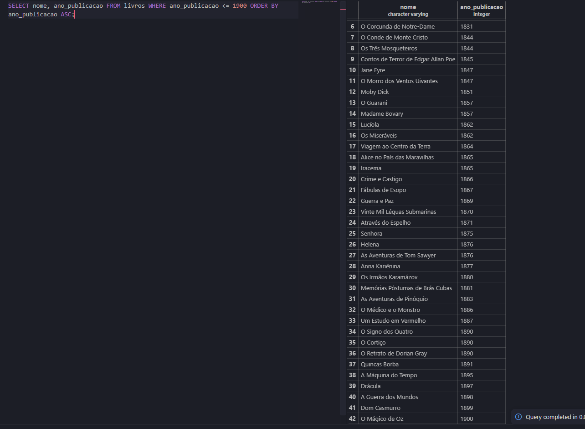

---

### 12. Liste os livros publicados entre 2010 e 2020, mostrando título, ano e gênero.

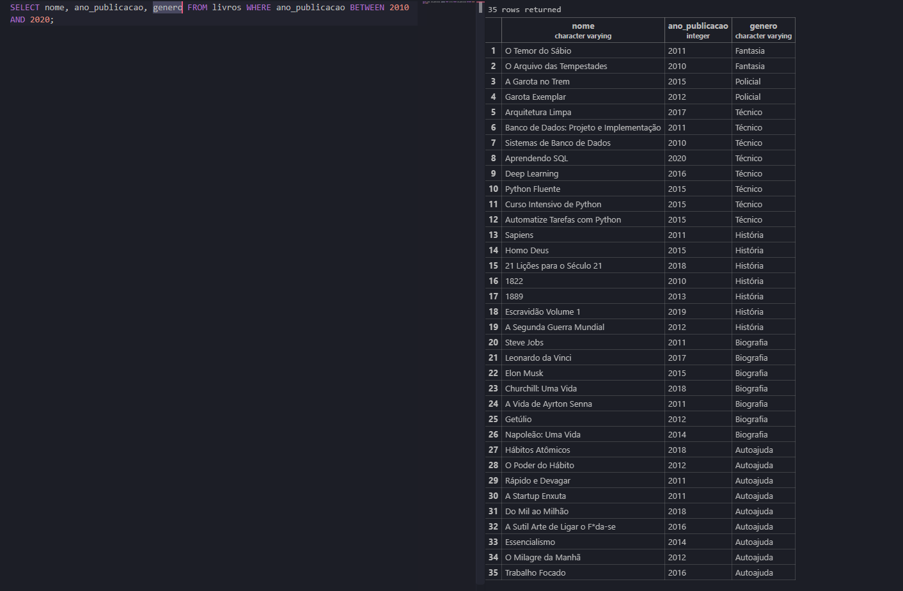

---