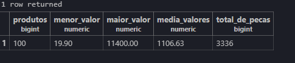

# Análise de dados

### Para ver quantas linhas tem e renomear a linha da tabela 

```sql
SELECT COUNT(*) AS total_de_produtos
FROM produtos;
```

#### Um exemplo: renomear a linha da tabela e pegar somente produtos com estoque abaixo de 10:

```sql
SELECT COUNT(*) AS total_de_produtos
FROM produtos
WHERE estoque < 10;
```

### Para ver o produto mais caro e barato:

```sql
SELECT 
    MAX(preco) AS produto_mais_caro, 
    MIN(preco) AS produto_mais_barato
FROM produtos;
-- o AS produto_mais_caro e produto_mais_barato significa renomear a tabela
```

### Para ver a média dos preços dos produtos:

```sql
SELECT AVG(preco) FROM produtos;
```

#### Para arredondar a media dos precos usamos:

```sql
SELECT ROUND(AVG(preco),2) AS preco_medio FROM produtos;
```

### Agora fizemos uma junção de tudo para deixar organizado e reorganizado a tabela:

```sql
SELECT 
    COUNT(*) AS produtos,
    MIN(preco) AS menor_valor,
    MAX(preco) AS maior_valor,
    ROUND(AVG(preco),2) AS media_valores,
    SUM(estoque) AS total_de_pecas
FROM produtos;
```

#### Imagem de como ficou:


### Aqui fizemos uma conta para vermos o estoque/faturamento de cada produto:

```sql
SELECT nome,
preco,
estoque,
preco * estoque AS total_de_preco_estoque
FROM produtos
ORDER BY total_de_preco_estoque DESC;
```

#### Para ver o faturamento total:

```sql
SELECT
    SUM(preco*estoque) AS patrimonio_total
FROM produtos;
```