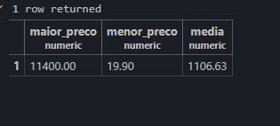

# AULA 08

## FIltro de COUNT
Para contagem de linhas de uma tabela:

```sql
SELECT COUNT(*) FROM produtos;
```

Para realizar contagem e renomear a tabela:

```sql
SELECT COUNT(*) AS total_registros FROM produtos;
```

Para aplicar filtros nas consultas de quantos produtos tem 10 ou mais em estoque:

```sql
SELECT COUNT(*) AS produtos_baixo_estoque FROM produtos WHERE estoque >= 10;
```

## Distintos

Para saber quantas categorias distintas tem:

```sql
SELECT DISTINCT categoria FROM produtos ORDER BY categoria ASC;
```

## Maior e menor valor
Para exibir o maior valor de preco:

```sql
SELECT MAX(preco) AS maior_preco FROM produtos;
```

Para saber o nome do produto mais caro:

```sql
SELECT nome,preco FROM produtos ORDER BY preco DESC;
```

Para exibir o menor valor de preco:

```sql
SELECT MIN(preco) AS menor_valor FROM produtos;
```

## Média
Para obter a média de uma coluna:

```sql
SELECT AVG(preco) AS media_precos FROM produtos;
```

Jeito certo de fazer a média de uma coluna arredondando as casas decimais:

```sql
SELECT ROUND(AVG(preco),2) AS media_correta FROM produtos;
```

Para exibir o Maior preço, menor e a média de todos os preços:

```sql
SELECT
    MAX(preco) AS maior_preco,
    MIN(preco) AS menor_preco,
    ROUND(AVG(preco),2) AS media 
FROM produtos;
```

Fica assim:


---

## Soma

Para somar todos os produtos do estoque:

```sql
SELECT SUM(estoque) AS total_produtos FROM produtos;
```

Para somar o total de faturamento vendendo todos os produtos da nossa loja Terabyte:

```sql
SELECT SUM(preco * estoque) AS total_faturamento FROM produtos;
```