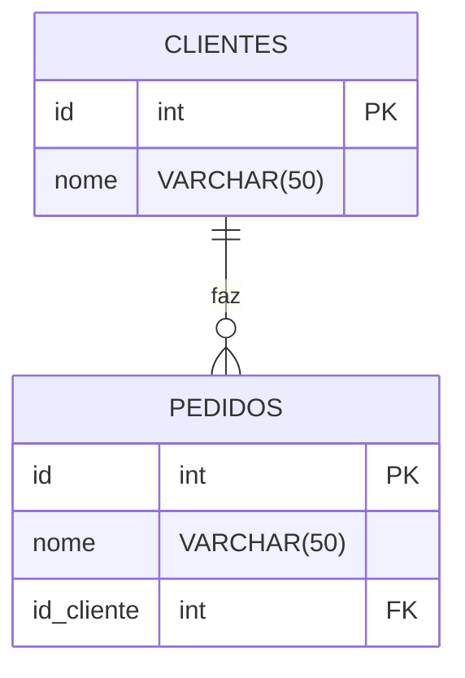
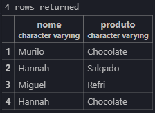

## Relacionamento entre tabelas

- Ideia principal: Um cliente pode possuir vários pedidos.

## Diagrama



1- Primeiro Criamos a tabela:
```sql
CREATE TABLE clientes(
    id SERIAL PRIMARY KEY,
    nome VARCHAR(50) NOT NULL
);

```

2- Criamos a segunda tabela:
```sql
CREATE TABLE pedidos(
    id SERIAL PRIMARY KEY,
    produto VARCHAR(50) NOT NULL,
    id_cliente INT REFERENCES clientes(id)
    -- REFERENCE significa que ele se referencia com a coluna id de clientes
);
```
3- Inserimos clientes em nossa tabela clientes:
```sql
INSERT INTO clientes(nome) VALUES
('Hannah'),
('Miguel'),
('Murilo'),
('Lucas');
```
4- Inserimos os pedidos e seus respectivos clientes:
```sql
INSERT INTO pedidos(produto, id_cliente) VALUES
('Chocolate',3),
('Salgado',1),
('Refri',2),
('Chocolate',1);
```
---

5- Para verificar quais os produtos cada cliente comprou:
```sql
SELECT clientes.nome,pedidos.produto
FROM pedidos
INNER JOIN clientes ON pedidos.id_cliente = clientes.id;
```
O que retorna:



6- Para verificar todos os clientes, até mesmo os que não compraram nada:
```sql
SELECT clientes.nome,pedidos.produto
FROM clientes
LEFT JOIN pedidos ON pedidos.id_cliente = clientes.id;
```